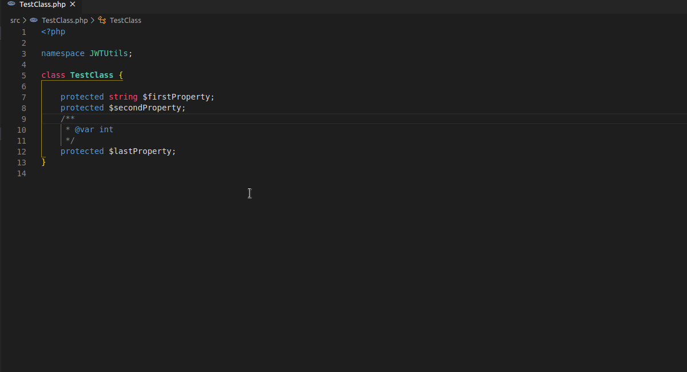
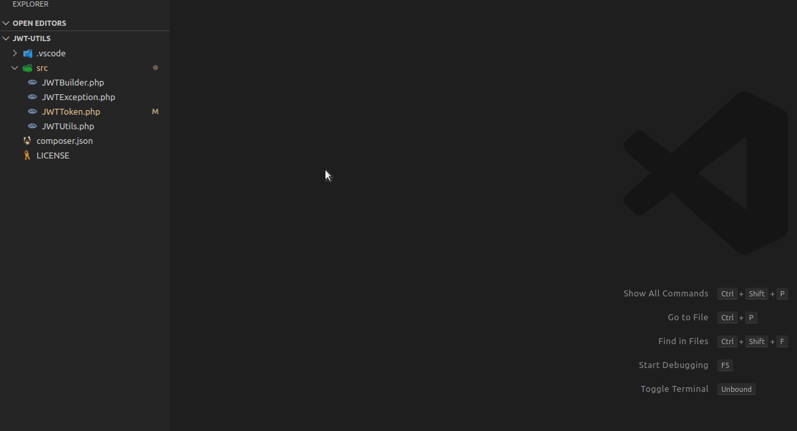

# PHP File & Code Generator

This is an extension to generate class methods (Construct and Getters/Setters) but also create new PHP file with class or interface template.

## Features

### Class methods generation: 

> To add only one getter/setter, select the line property before choosing "Add property getter"

### Class/Interface file generation: 

## Requirements

No requirements

## Extension Settings

This extension contributes the following settings:

* `php-generator.newLineBeforeBrackets`: Boolean: True to insert open bracket on a new line. Default is true (PSR-12).
* `php-generator.tabSize`: Integer|Null : Number of spaces used for tabs. If null, get editor tab size (editor.tabSize). Default is null.
* `php-generator.addNamespace`: Boolean: True to add namespace on generated files. It use composer.json file to get namespace list. Default is true.

## Release Notes

### 1.0.0

Method generation:
* Construct
* Getter and Setter
* All getter and All setter

New file generation: 
* Class, Interface
* Add namespace in generated files
